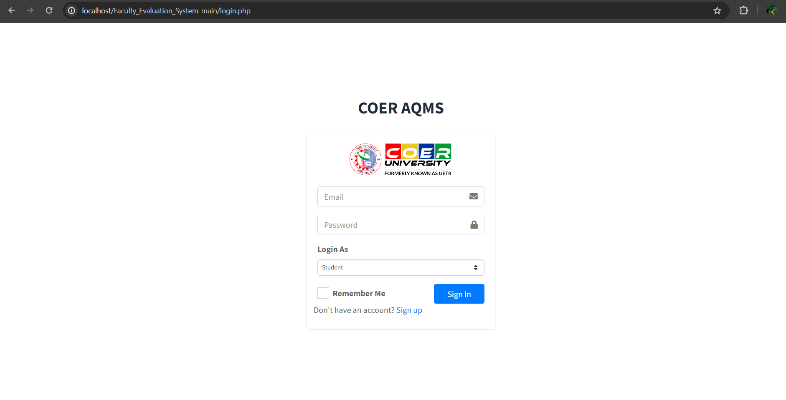
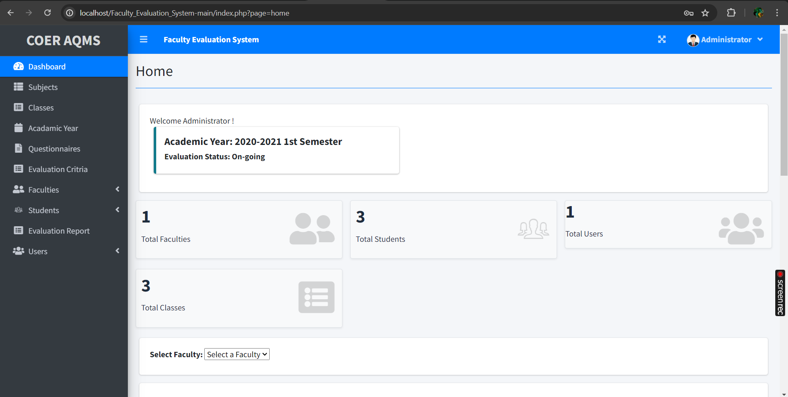
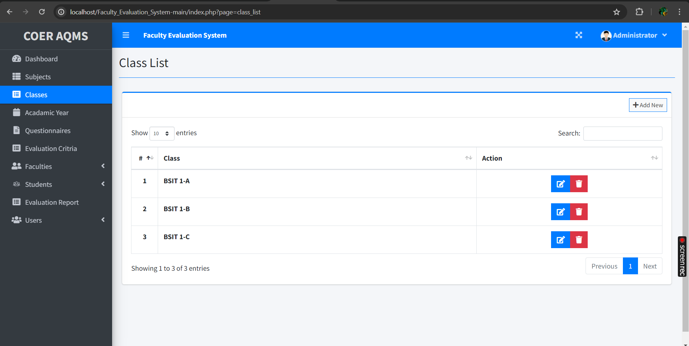
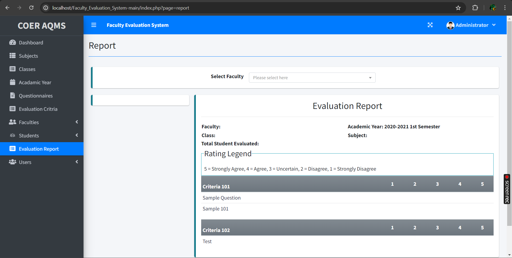
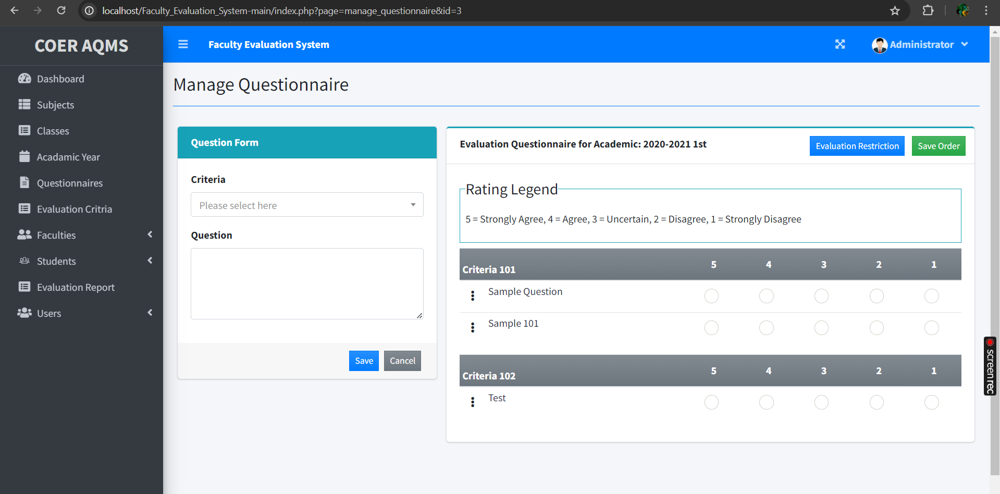

# 👩‍🏫ProfPraisal


## 👇About ProfPraisal
The ProfPraisal is a PHP/MySQL project that helps an individual school manage its evaluation results. The system has three user types which are the Administrator, Faculties, and the Students.
<br>
The Administrator user is in-charge of maintaining and populate the data in the system database using the front-end feature for the admin sides, such as the list of subjects, faculties, students, and some other related data. The student users are permitted only to evaluate the faculties assigned to their class per issue.The faculties users are only allowed to view their evaluation result even the evaluation is still ongoing.


## 🌟 Why Use This System
1. **Efficient Evaluation Management:** The ProfPraisal streamlines the evaluation process, ensuring that all evaluations are systematically organized and managed.

2. **User-friendly Interface:** The system provides an intuitive and easy-to-navigate interface for all user types, enhancing user experience and reducing the learning curve.

3. **Role-based Access Control:** Different functionalities and access levels are provided to administrators, faculties, and students, ensuring that each user type has access only to relevant features and data.

## 💫 Features for different users :
### For Admin:
👉 Login Page<br>
👉 Dashboard Page<br>
👉 Subject Management<br>
👉 Class Management<br>
👉 Faculties Management<br>
👉 Student Management<br>
👉 Evaluation Criteria Management<br>
👉 Academic Year Management<br>
👉 Evaluation Questionnaire Management<br>
👉 Users Management<br>

### For Faculties:
👉Login Page<br>
👉Dashboard Page<br>
👉View Evaluation Result<br>


### For Students:
👉Login Page<br>
👉Dashboard Page<br>
👉Evaluate Faculties<br>

## 📌 Tech Stack


## 📸Screenshots
<br>Login Page<br>

<br>Home Page<br>

<br>Class Page<br>

<br>Report Page<br>

<br>Questionnaire Page<br>



## 🤝How to Contribute

If you think that you can add a new feature or want to fix a bug, we invite you to contribute to **ProfPraisal
** and make this project better. 
<br>To start contributing, follow the below instructions:

1.  Create a folder in your xampp htdocs.

2.   Open Git Bash there.

3.  Create a Git repository.
            Run command  `git init`
            
4.  Fork the  [repository](https://github.com/SaiyamTuteja/Faculty_Evaluation_System.git).

5.  Clone your forked repository of project.
```
git clone https://github.com/<your_username>/Faculty_Evaluation_System.git
```

6.  Navigate to the project directory.

```
cd Faculty_Evaluation_System
```
7.  Add a reference(remote) to the original repository.

```
git remote add upstream https://github.com/SaiyamTuteja/Faculty_Evaluation_System.git
```
8.  Check the remotes for this repository.

```
git remote -v
```

9.  Always take a pull from the upstream repository to your main branch to keep it updated as per the main project repository.

```
git pull upstream main
```

10.  Create a new branch(prefer a branch name that relates to your assigned issue).

```
git checkout -b <YOUR_BRANCH_NAME>
```

11.  Perform your desired changes to the code base.
    
12.  Check your changes.
    

```
git status
```

```
git  diff
```

13.  Stage your changes.

```
git add . <\files_that_you_made_changes>
```

14.  Commit your changes.

```
git commit -m "relavant message"
```

15.  Push the committed changes in your feature branch to your remote repository.

```
git push -u origin <your_branch_name>
```

16.  To create a pull request, click on  `compare and pull requests`.
    
17.  Add an appropriate title and description to your pull request explaining your changes.
    
18.  Click on  `Create pull request`.
    

Congratulations🎉, you have made a pull request to the ProfPraisal. Wait for your submission to be accepted and merged.


## 💻How to run on your local system and setup database


<h2 align = "center">Our Contributors ❤️</h2>
<div align = "center">
 <div>
  <h2> Contributors</h2>
</div>

Thank you for contributing to our project! We appreciate your help in Faculty_Evaluation_System even better.😃

<center>
<a href="https://github.com/SaiyamTuteja/Faculty_Evaluation_System/graphs/contributors">
  
</a>

### Show some ❤️ by starring this awesome repository!

</div>

## Database Initialization

1. Firstly, open the folder database 


To set up the database, you can download the `evaluation_db.zip` file, which contains the `evaluation_db.sql` file.

[Download evaluation_db.zip](database/evaluation_db.zip)

2. After downloading the SQL file, setup XAMPP


3. Click on `ADMIN` in the MYSQL, then MyPhpAdmin would open up


4. Click on new to create a database with the name `evaluation_db`


5. Now click on import, where you need to upload the file previously downloaded to setup the database and get all the tables in the database


6. Finally, you could see the tables in the database


For more information refer to the video documentation:
[Video](https://drive.google.com/file/d/10mM0y7YKW3bdqq_ltcBM38YxIAF4iP-u/view?usp=sharing)
